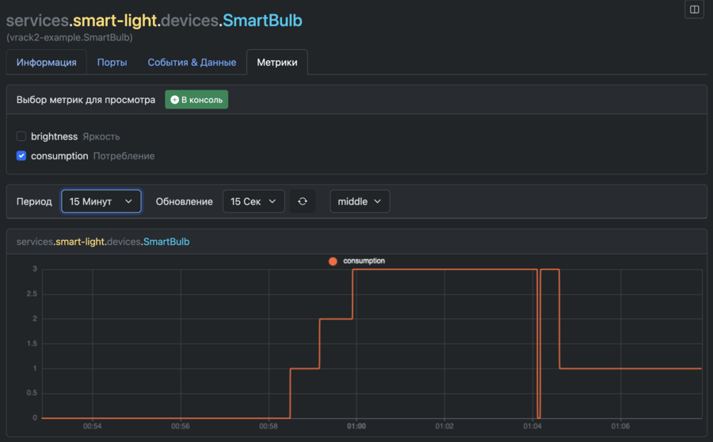
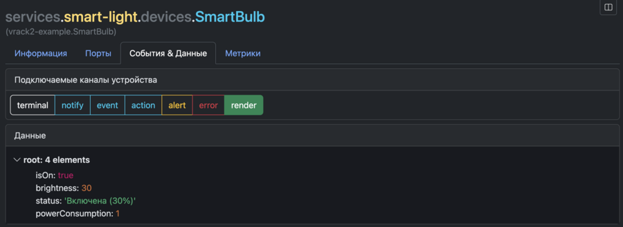
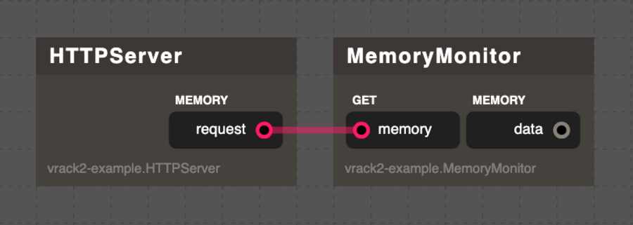

# VRack2 Примеры

- [VRack2 Примеры](#vrack2-примеры)
  - [Установка](#установка)
  - [Умная лампочка](#умная-лампочка)
    - [Цель проекта](#цель-проекта)
    - [Состав проекта](#состав-проекта)
    - [Как это работает](#как-это-работает)
    - [Использование VRack2 Manager](#использование-vrack2-manager)
  - [HTTP-сервер с мониторингом памяти](#http-сервер-с-мониторингом-памяти)
    - [Цель проекта](#цель-проекта-1)
    - [Состав проекта](#состав-проекта-1)
    - [Как это работает](#как-это-работает-1)
    - [Для чего это полезно?](#для-чего-это-полезно)
  - [Умный термостат](#умный-термостат)
    - [Цель проекта](#цель-проекта-2)
    - [Состав проекта](#состав-проекта-2)
    - [Как это работает](#как-это-работает-2)
    - [Для чего это полезно?](#для-чего-это-полезно-1)


Набор простых учебных сервисов оформеленных в виде готового репозитория. Все файлы устройств содержат комментарии работы. 

## Установка

Перед установкой - необходимо установить [VRack2]()

Перейдите в директорию вендоров устройств VRack2 - `/opt/vrack2-service/devices` по умолчанию.

```bash
cd /opt/vrack2-service/devices
```

Склонируйте репозиторий: 

```bash
git clone https://github.com/VRack2/vrack2-example.git
```

Все почти готово. Осталось установить файлы сервисов.

Скопируйте файлы сервисов в директорию сервисов:

```bash
cp -r /opt/vrack2-service/devices/vrack2-example/services/*  /opt/vrack2-service/services/
```

Отлично теперь запустите/перезапустите VRack2. 

Пример:

```bash
cd /opt/vrack2-service/
npm run start
```

После запуска VRack2 - сервисы запустятся автоматически.

**Используйте [VRack2 Manager](https://github.com/VRack2/vrack2-manager) что бы использовать экшены,  просматривать события и данные**


## Умная лампочка


### Цель проекта
Создать простую, но полноценную систему управления лампочкой, в которой:
- **лампочка** может включаться/выключаться и менять яркость;
- **переключатель** (ToggleSwitch) управляет состоянием вкл/выкл;
- **регулятор яркости** (Dimmer) задаёт уровень освещения от 0 до 100%;
- все компоненты взаимодействуют между собой через порты;
- состояние системы доступно в реальном времени через интерфейс;
- действия можно выполнять как через связи, так и через API-экшены;
- поведение устройства можно настраивать через параметры в сервис-файле.

### Состав проекта

1. **`ToggleSwitch`** — виртуальная кнопка-переключатель  
   - При получении сигнала или вызове экшена меняет своё состояние (`вкл` ↔ `выкл`).  
   - Отправляет текущее состояние на выходной порт `state`.  
   - Поддерживает два экшена: переключение и запрос состояния.

2. **`Dimmer`** — регулятор яркости  
   - Принимает команды на установку точного уровня яркости или относительную корректировку (±N).  
   - Имеет начальное значение яркости, задаваемое в настройках (`initialLevel`).  
   - Публикует текущий уровень на выход `level`.  
   - Поддерживает экшены для установки и запроса яркости.

3. **`SmartBulb`** — умная лампочка  
   - Реагирует на сигналы включения/выключения и изменения яркости.  
   - Автоматически рассчитывает энергопотребление в зависимости от яркости.  
   - Публикует метрики яркости и потребления в систему мониторинга (VRackDB).  
   - Отображает своё состояние (`включена/выключена`, `% яркости`) в реальном времени.

### Как это работает

- При запуске сервиса создаются три устройства.
- Переключатель по умолчанию выключен, диммер — на 50% (если не задано иное в `options`).
- Когда вы нажимаете кнопку в интерфейсе (или вызываете экшен через API), состояние обновляется и передаётся по цепочке:
  - `ToggleSwitch` → включает/выключает лампу.
  - `Dimmer` → меняет яркость лампы.
- Все изменения отображаются мгновенно в интерфейсе благодаря механизму `shares`.
- Метрики яркости и энергопотребления записываются каждую секунду и доступны для анализа.

### Использование VRack2 Manager

Используя VRack2 Manager изучайте возможности взаимодействия с устройствами сервиса.

Прим. Смена состояние кнопки: 


Установка яркости: 


VRack2 Manager автоматически формирует документацию на основе кода:


Просмотр потребления лампы:



Просмотр онлайн данных лампы: 




##  HTTP-сервер с мониторингом памяти



### Цель проекта

Создать простой, но функциональный HTTP-сервер, который:
- принимает GET-запросы по пути `/memory`;
- перенаправляет их на устройство-монитор памяти;
- возвращает JSON с актуальной информацией о потреблении памяти Node.js-процессом;
- автоматически обновляет данные каждую секунду;
- отображает статистику (например, количество обработанных запросов) в интерфейсе VRack2.

Проект иллюстрирует ключевые возможности VRack2:
- использование **возвращаемых портов** для синхронного обмена данными между устройствами;
- динамическую маршрутизацию HTTP-запросов на основе URL и метода;

### Состав проекта

1. **`HTTPServer`** — встроенный HTTP-сервер  
   - Запускается на указанном хосте и порту (по умолчанию `0.0.0.0:8090`).  
   - Поддерживает CORS и возвращает JSON-ответы.  
   - Автоматически преобразует URL-путь в имя метода:  
     `GET /memory` → вызывает метод `GETMemory()`.  
   - Использует **возвращаемый порт** `memory.request` для запроса данных у другого устройства.  
   - Ведёт счётчик обработанных запросов в `shares.requests`.

2. **`MemoryMonitor`** — сборщик информации о памяти  
   - Каждую секунду обновляет данные о потреблении памяти процессом Node.js.  
   - Содержит информацию:
     - RSS, heapTotal, heapUsed, external, arrayBuffers (в мегабайтах);
     - процент использования кучи;
     - uptime процесса.  
   - Предоставляет эти данные через **возвращаемый порт** `get.memory`, на который может подписаться любой компонент.  
   - Все данные публикуются в `shares.memory` и доступны в реальном времени через интерфейс.

### Как это работает

1. При запуске сервиса:
   - `MemoryMonitor` начинает обновлять данные о памяти каждую секунду.
   - `HTTPServer` запускает встроенный HTTP-сервер на порту 8090.

2. Когда приходит HTTP-запрос `GET /memory`:
   - Сервер вызывает метод `GETMemory()`.
   - Тот отправляет запрос через `memory.request` → `get.memory`.
   - `MemoryMonitor` возвращает текущие данные из `shares.memory`.
   - Сервер формирует JSON-ответ и отправляет клиенту.

3. Все изменения в `shares` (счётчик запросов, данные памяти) автоматически отображаются в VRack2 Manager.

4. Если запрос приходит на несуществующий путь — возвращается ошибка 404.  
   При исключении в обработчике — ошибка 500.

### Для чего это полезно?

Этот проект — отличный пример того, как:
- использовать **возвращаемые порты** для построения запрос-ответных взаимодействий;
- реализовать **гибкую маршрутизацию** на основе URL без фреймворков;
- создавать **реактивные веб-панели**, где данные обновляются автоматически.

Он подходит как основа для более сложных сервисов: мониторинга CPU, диска, сети, управления устройствами через REST API или построения микросервисов внутри VRack2.

## Умный термостат


### Цель проекта

Создать устройство-термостат, которое:
- получает текущую температуру от внешнего датчика;
- сравнивает её с заданной целевой температурой;
- включает/выключает «обогреватель» (виртуальное устройство) при необходимости;
- сохраняет целевую температуру между перезапусками;
- отправляет уведомления;
- публикует метрики температуры и статуса обогрева;
- поддерживает настройку через экшены и порты.

Проект охватывает ключевые возможности VRack2:
- работу с `storage` для сохранения состояния;
- использование `shares` для отображения статуса в реальном времени;
- регистрацию и запись метрик;
- отправку уведомлений через `notify`/`alert`;
- взаимодействие через стандартные и возвращаемые порты;
- управление через API-экшены.

### Состав проекта

1. **`TemperatureSensor`** — имитация датчика температуры с плавным изменением  
   - Генерирует температуру по синусоидальному закону на основе текущего времени.  
   - Диапазон значений: от **19°C до 26°C** (среднее — 22.5°C, амплитуда ±3.5°C).  
   - Период колебаний — **60 секунд**, что имитирует медленные суточные изменения температуры.  
   - Обновляет значение каждые **2 секунды** и отправляет его на выходной порт `temperature`.  
   - Одновременно записывает текущую температуру как метрику `temp.value` для последующего анализа и визуализации.  
   - Все данные публикуются в `shares.temp` и отображаются в реальном времени в интерфейсе VRack2 Manager.

2. **`SmartThermostat`** — «мозг» системы  
   - Принимает текущую температуру через порт `input.temperature`.  
   - Сравнивает с целевой температурой из `storage.targetTemp`.  
   - Управляет виртуальным обогревателем через выход `heater.control` (`true`/`false`).  
   - Сохраняет целевую температуру при изменении через экшен или порт.  
   - Отправляет `notify` при включении/выключении обогрева и `alert`, если температура выходит за критические пределы (например, <10°C или >40°C).  
   - Поддерживает экшены:
     - `set.target` — установить целевую температуру;
     - `get.status` — получить текущий статус.

3. **`HeaterSimulator`** — виртуальный обогреватель  
   - Принимает команду включения/выключения через порт `power`.  
   - Отображает статус (`Включен`/`Выключен`) в `shares`.  
   - Публикует метрику `heater.on` (0/1).


### Как это работает

1. **Запуск**:
   - `TemperatureSensor` начинает генерировать температуру.
   - `SmartThermostat` загружает целевую температуру из `storage` (по умолчанию 23°C).
   - `HeaterSimulator` ожидает команд.

2. **Работа**:
   - Каждые 2 секунды датчик отправляет новую температуру.
   - Термостат сравнивает её с целевой и включает/выключает обогреватель с гистерезисом.
   - Все изменения отображаются в интерфейсе через `shares`.
   - Метрики записываются в VRackDB и доступны для графиков.
   - При критической температуре приходит `alert`.

3. **Управление**:
   - Через экшен `set.target` можно изменить целевую температуру — она сохранится после перезапуска.
   - Через `get.status` — получить полный статус системы.

### Для чего это полезно?

Этот проект — готовая основа для:
- домашней системы отопления или кондиционирования;
- учебной модели автоматизации с обратной связью;
- интеграции с реальными датчиками (через HTTP или MQTT-адаптеры);
- построения панелей мониторинга с историей и уведомлениями.


Что дальше?

В репозитории [VRack2](https://github.com/VRack2/vrack2) можно найти полную документацию по разработке устройств и связанные репозитории.
